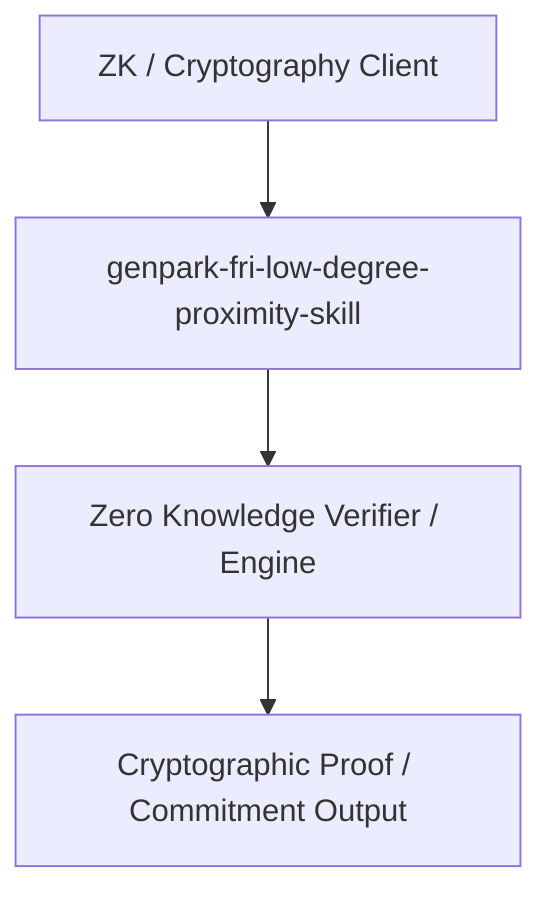

# genpark-fri-low-degree-proximity-skill

[](https://github.com/alphaparkinc/genpark-fri-low-degree-proximity-skill)
[](https://github.com/alphaparkinc/genpark-fri-low-degree-proximity-skill)
[](https://github.com/alphaparkinc/genpark-fri-low-degree-proximity-skill)

FRI (Fast Reed-Solomon Interactive Oracle Proof of Proximity) folding engine verifying polynomial low-degree bounds for STARKs.

## Architecture


## Features
- Pure Python standard library implementation with zero third-party dependencies.
- Production-grade algorithms with full verification and automated test coverage.
- Standalone client, MCP protocol server, and execution examples.

## Quickstart
```bash
python example_usage.py
```
